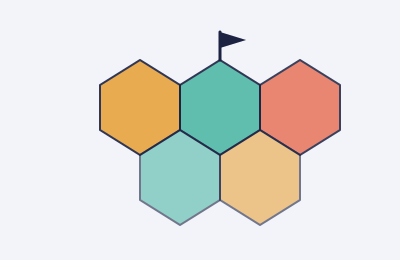
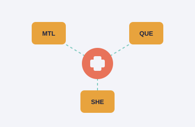
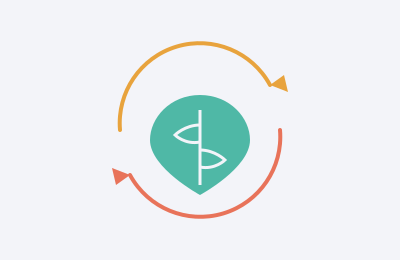

 

---

## 👨‍💻 About Me

- 🎓 MEng in Software Engineering student at **Concordia University**, Montreal (SOEN)
- 💻 Full-stack developer experienced across **backend APIs, mobile apps, desktop software, and distributed systems**
- ☕ Strong Java background — from GoF design-pattern-driven applications to CORBA-based distributed systems
- 🗄️ Comfortable across relational database systems — **MySQL, Oracle DB, Microsoft SQL Server** — including schema design and data migration using **MySQL Workbench**
- 🌱 Currently exploring **context-aware computing** and **ontology/knowledge-graph-based reasoning**
- 🛠️ Work end-to-end: REST API design, OAuth-based auth, layered (N-tier) architecture, and distributed system design
- 📫 Best way to reach me: [LinkedIn](https://www.linkedin.com/in/mridulhossain/)

---

## 🧰 Tech Stack

**Languages**

**Frameworks & Platforms**

**Databases & Data Tools**

**Tools**

---

## 🚀 Featured Projects

<table>

<tr>
<td width="300"></td>
<td>

### 🧭 Context-Aware Intelligent Travel Companion
`Python` `KivyMD` `Ontology / OWL Reasoning` `Google Places API` `OAuth 2.0` `SQLite`

Context-aware mobile travel assistant (Concordia SOEN 7761) that fuses real-time **location, weather, and time** signals with an **OWL ontology** (via Owlready2/Protégé) to reason about and recommend restaurants and activities. Built with Python and KivyMD, integrating the Google Places API, OpenWeatherMap API, and Google OAuth 2.0 for secure sign-in.

[View Repository →](https://github.com/mridul-hossain/Context-Aware-Travel-App)

</td>
</tr>

<tr>
<td width="300"></td>
<td>

### ⚔️ Warzone Strategy Game Engine
`Java` `Design Patterns` `OOP` `Game Engine`

Team-built Risk-style strategy game (Concordia SOEN 6441) architected around multiple GoF design patterns: **State** for the game-phase engine (map editor → startup → reinforcement → order creation → order execution), **Strategy** for pluggable AI player behaviors, **Adapter** for map file I/O, **Observer** for game logging, and **Command** for order execution.

[View Repository →](https://github.com/WasifAkram1997/SOEN6441_Warzone)

</td>
</tr>

<tr>
<td width="300"></td>
<td>

### 🏥 Distributed Medical Appointment System
`Java` `Distributed Systems` `CORBA` `Maven`

Distributed hospital appointment system (Concordia COMP 6231 — Distributed System Design) built with **CORBA** middleware and **replicated servers** across three regional hospitals (Montreal, Quebec, Sherbrooke), using a replica-manager pattern to handle concurrent requests with fault tolerance.

[View Repository →](https://github.com/mridul-hossain/medical-appointment-project)

</td>
</tr>

<tr>
<td width="300"></td>
<td>

### 🌾 Smart Agro Management — Backend API
`PHP` `REST API` `E-commerce Backend` `CRUD`

REST API powering a **farmer-to-consumer agricultural marketplace**. Handles farmer and customer registration/login, product catalog management, shopping cart and order processing, delivery tracking, and a ratings & review system connecting farmers directly to buyers.

[View Repository →](https://github.com/Smart-Agro-Management/sams-backup-php-api)

</td>
</tr>

<tr>
<td width="300"></td>
<td>

### 📱 Smart Agro Management — Mobile App
`React Native` `JavaScript` `Cross-Platform Mobile`

Cross-platform **React Native** companion app for the Smart Agro Management platform — gives customers a mobile storefront to browse farm products, manage their cart, and place orders directly from their phone.

[View Repository →](https://github.com/Smart-Agro-Management/sams-mobile-app)

</td>
</tr>

<tr>
<td width="300"></td>
<td>

### ☕ Coffee Shop Management System
`C#` `.NET` `N-Tier Architecture` `Desktop App`

Desktop management system for coffee shop operations, built in **C#** with a layered **Presentation / Business Logic / Data Access** architecture. Handles login & registration, order placement and cancellation, inventory tracking with low-stock alerts, and monthly profit reporting.

[View Repository →](https://github.com/mridul-hossain/Coffee-Shop-Management-System)

</td>
</tr>

<tr>
<td width="300"></td>
<td>

### 📔 Digital Diary
`C#` `WinForms` `CRUD` `Desktop App`

WinForms journaling application with secure login, full **CRUD** note management, priority tagging, and image attachments per entry — built around a dedicated data-access layer for persistence.

[View Repository →](https://github.com/mridul-hossain/Digital-Diary)

</td>
</tr>

</table>

---

Thanks for visiting — feel free to explore my [repositories](https://github.com/mridul-hossain?tab=repositories) or connect on [LinkedIn](https://www.linkedin.com/in/mridulhossain/)!

